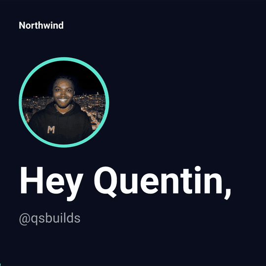
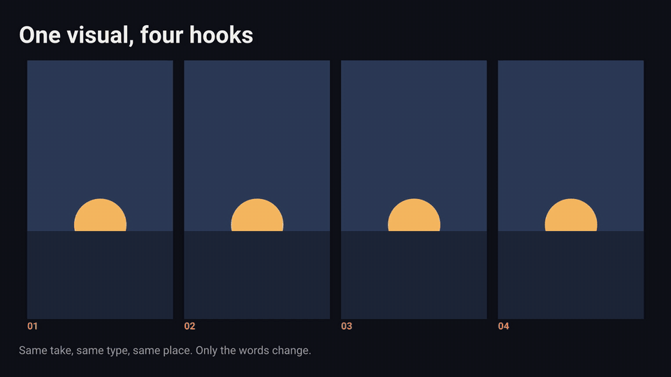

# m0saic-outreach

**Marketing video as templates an agent fills in.** Each template here was
written by an agent for one specific job. The job's inputs are a props file,
the output is the same pixels every time, and nobody opens an editor.

| Template | What it makes |
|---|---|
| [`@outreach/invite/why-you/v1`](#why-you-a-personalized-clip-per-recipient) | A 15-second clip addressed to one person: their name and face, why them, your pitch, their link. |
| [`@outreach/social/live-hooks/v1`](#live-hooks-one-visual-many-hooks-landing-word-by-word) | The animated text layer of a short-form post: one visual, up to four hooks landing word by word, as the post itself or side by side to compare. |

## Why You: a personalized clip per recipient

Your agent already writes the cold message. Have it fill a props file
instead, and the message is a video with the recipient's name and face on
the first frame.



*The example above, with sound-free MP4: [`examples/northwind-to-qsbuilds/clip.mp4`](examples/northwind-to-qsbuilds/clip.mp4).
It was rendered from [this 22-line JSON file](examples/northwind-to-qsbuilds/props.json)
and one profile picture. Nobody opened an editor.*

### The idea

An outreach agent does three things per recipient: looks at their profile,
decides why they are worth writing to, writes the message. The output is
text, and text from an agent reads like text from an agent.

`@outreach/invite/why-you/v1` is a [m0saic](https://m0saic.io) template. It
takes what the agent already has and renders a 15-second clip in four beats:

1. **Hello** - their picture, "Hey Quentin," and their handle. It is on
   screen from frame 0, so the thumbnail in a DM is their own name and face.
2. **Why you?** - one to three reasons, landing one at a time. This is the
   question a cold message never answers.
3. **The pitch** - your brand, tagline and a sentence or two.
4. **The ask** - the call to action and the link, held to the last frame.

The agent does no video work. It writes JSON; m0saic lays out, fits and
animates. The same props render the same pixels, so a list of a thousand
recipients is a loop, and a clip you approved once stays approved.

### Render one: three pastes

You need Node 18.17+. `dist/` is committed, so a clone renders with no
`npm install` in the repo and no build.

**1. Install m0saic** (once per machine; `setup` fetches a pinned ffmpeg
and asks before it downloads):

```
npm i -g m0saic && m0saic setup
```

**2. Get the template:**

```
git clone https://github.com/m0saic-dev/m0saic-outreach && cd m0saic-outreach
```

**3. Render it** at its defaults (a made-up brand writing to a made-up Alex):

```
m0saic make @outreach/invite/why-you/v1 --template-repo . -o demo.mp4
```

That takes about 20 seconds on a laptop. To make it yours, hand it props.
Anything you leave out keeps its default:

```
m0saic make @outreach/invite/why-you/v1 --template-repo . -o jordan.mp4 --props '{"recipientName":"Jordan","recipientHandle":"@jordanships","brandName":"Acme","tagline":"Ship it faster","accent":"#5eead4","background":"#0b1020"}'
```

To reproduce the clip at the top of this page, picture included:

```
node tools/outreach.mjs examples/northwind-to-qsbuilds/props.json -o quentin.mp4
```

Other canvases re-flow:

```
node tools/outreach.mjs examples/northwind-to-qsbuilds/props.json -o wide.mp4 -w 1920 -h 1080
node tools/outreach.mjs examples/northwind-to-qsbuilds/props.json -o reel.mp4 -w 1080 -h 1920
```

`tools/outreach.mjs` is a thin wrapper over
`m0saic make @outreach/invite/why-you/v1 --template-repo . --props @file.json`.
It exists because a picture prop needs an absolute path at render time and a
props file that travels wants a relative one; the wrapper resolves
`recipientImage` against the JSON file.

### The props

Everything is optional except the two names. An empty string removes that
line and the layout closes up.

| Prop | What it is | Example |
|---|---|---|
| `recipientName` | Who the clip is for. Required. | `"Quentin"` |
| `recipientHandle` | Their handle, under the greeting. | `"@qsbuilds"` |
| `recipientImage` | A profile picture, cropped to a disc. Without one the disc shows their initials. | `"avatar.jpg"` |
| `greeting` | The word before the name. | `"Hey"` |
| `question` | The line that opens beat two. | `"Why you?"` |
| `reasons` | One to three reasons, a line each (two lines at most when wrapped). | `["You ship in public."]` |
| `brandName` | Who is writing. Required. | `"Northwind"` |
| `tagline` | Under the brand name, in the accent. | `"Warm intros, on autopilot"` |
| `pitch` | One or two sentences. Breaks at the sentences when it can. | |
| `ctaLabel` | The line above the link. | `"Your personal invite"` |
| `ctaUrl` | The link, in the pill. | `"northwind.example/invite/quentin"` |
| `signoff` | Who signed it. | `"Sam, founder of Northwind"` |
| `accent`, `background`, `ink` | Your brand colours, `#rrggbb`. | `"#5eead4"` |
| `durationSec` | Clip length, 8 to 60. The beats keep their shares. | `15` |

Copy is fitted, never clipped: a long name shrinks, a long reason wraps to
two lines, and only at the smallest size does anything get an ellipsis.
Text is Latin script. Emoji and other scripts in scraped profile copy are
dropped rather than drawn as empty boxes.

### Render a list

Put what every clip shares in `shared` and one object per person in
`recipients`:

```json
{
  "shared": {
    "brandName": "Northwind",
    "tagline": "Warm intros, on autopilot",
    "pitch": "Tell Northwind who you need to meet. It finds the shortest trusted path there.",
    "ctaLabel": "Your invite is waiting",
    "signoff": "Sam, founder of Northwind",
    "accent": "#7c9cff"
  },
  "recipients": [
    {
      "recipientName": "Alex",
      "recipientHandle": "@alexbuilds",
      "recipientImage": "avatars/alex.jpg",
      "reasons": ["You ship in public, every single day.", "Your agents already do the busywork."],
      "ctaUrl": "northwind.example/invite/alex"
    }
  ]
}
```

```
node tools/outreach.mjs recipients.json --out-dir out
```

One MP4 per recipient lands in `out/`, named after the handle, rendered one
at a time. `--dry` prints the plan without rendering.

### Wiring it into an agent

The step your agent adds is small. For each recipient it already researches,
ask it for the JSON object above instead of (or as well as) the message
text, then run the command. In practice the prompt change is one paragraph:

> For each recipient, return a JSON object with `recipientName`,
> `recipientHandle`, the path of their downloaded profile picture as
> `recipientImage`, and `reasons`: up to three specific, true, one-line
> reasons this person is a fit, each under 60 characters, drawn from their
> public profile. Do not flatter and do not invent.

The reasons are the whole clip. A reason that could be sent to anyone
("you're a top builder") makes a personalized video feel more automated,
not less. A reason that names what the person actually does is what makes
them wonder how the video was made.

## Live Hooks: one visual, many hooks, landing word by word



A generated visual is the expensive half of a short-form post, and you
cannot generate the same one twice. The hook over it is the cheap half, and
it is the half that gets tested. `@outreach/social/live-hooks/v1` keeps them
apart: the visual is a file, the hooks are strings, and each hook is one
more render with the same visual, the same type, the same position and the
same timing.

- **The hook moves.** It lands word by word (`words`), line by line
  (`lines`) or all at once (`pop`), each piece hopping up into place. Every
  word is its own rectangle cut from one fitted block, so the animated hook
  ends on exactly the pixels a static one would have.
- **One hook** renders the post itself at 1080x1920.
- **Two to four hooks** render the same post side by side under a title,
  the tiles starting one after another, so the variants can be compared in
  one clip.
- **Two styles**: `outline` (white type, dark edge) and `box` (dark type on
  a white label). Every hook in a render shares one size.
- **Safe area**: hooks stay clear of the platform's right-hand rail, top bar
  and caption block. A long hook shrinks and wraps; it never runs under the
  interface or off the frame.
- **Stills too**: `hookMotion: "none"` with a still visual renders a PNG, a
  slideshow slide.

With no visual it draws a flat stand-in scene, so it renders from a bare
clone. `npm run demo` is the first line below under a shorter name, and
passes anything after `--` through (`npm run demo -- --props ...`):

```
m0saic make @outreach/social/live-hooks/v1 --template-repo . -o demo.mp4
m0saic make @outreach/social/live-hooks/v1 --template-repo . --props @examples/live-hooks/props.json -o wall.mp4
```

With your own visual and hooks (the path must be absolute):

```
m0saic make @outreach/social/live-hooks/v1 --template-repo . -o post.mp4 --props '{"visual":["/abs/path/take.mp4"],"hooks":["POV: you finally stopped doing this by hand"]}'
```

| Prop | What it is |
|---|---|
| `visual` | Zero or one image or video under the hook. |
| `hooks` | One to four hooks. |
| `hookMotion` | `"words"`, `"lines"`, `"pop"` or `"none"`. |
| `hookStyle` | `"outline"` or `"box"`. |
| `hookPosition` | `"top"` or `"middle"`. |
| `title`, `note` | The lines above and below the tiles when comparing. |
| `accent`, `background`, `ink` | Colours of the comparison frame, `#rrggbb`. |
| `durationSec` | Clip length, 2 to 60. |

Two limits to know. Hooks are Latin text: emoji are dropped, not drawn as
empty boxes, and an emoji layer is the obvious next version. And a render
carries at most 34 moving pieces: past that the motion steps down by itself
(words, then lines, then all at once), and the engine's report still notes
a deep overlay chain for a full word-by-word comparison.

`@outreach/social/hook-wall/v1` is the first, static version of this
template. It is kept because a shipped template is never edited, and it is
marked as superseded by this one.

## In Mosaic Desktop

Templates → **Add source** → paste this repo's URL → consent. Each template
opens in Make with every line bound to its prop: double-click a line to
edit it in place, drop a picture or a clip on its slot.

## About the examples

No real company is named anywhere in this repo. `examples/live-hooks` uses
the built-in stand-in visual. `examples/northwind-to-qsbuilds` is addressed to this repo's author,
[@qsbuilds](https://x.com/qsbuilds), so the recipient is real and the
picture is his own. The sender, Northwind, is made up, and so is everything
in the template's defaults.

## Develop

```
npm install
npm run verify     # build + lint + jest + loader contract + dependency policy
m0saic doctor .    # the same conventions, from the CLI
```

Each template is one file (`src/<pack>/<slug>/v1/<slug>.ts`) and its header
comment is the design. Each test sweeps the layout contract at seven
canvases with defaults, long copy and every mode.
`dist/` and `template-manifest.json` are committed, so run `npm run build`
before every commit. A shipped template never changes: a fix is a `v2`
folder. Agents: read [`AGENTS.md`](AGENTS.md) first.

This is a third-party template repo (namespace `@outreach`, unsigned).
Loading any template repo runs its code on your machine; `src/` is the
whole story and `dist/` is its build.

## License

MIT. Built with the `@m0saic/*` packages from npm. The example profile
picture belongs to its subject and is not covered by the license.
